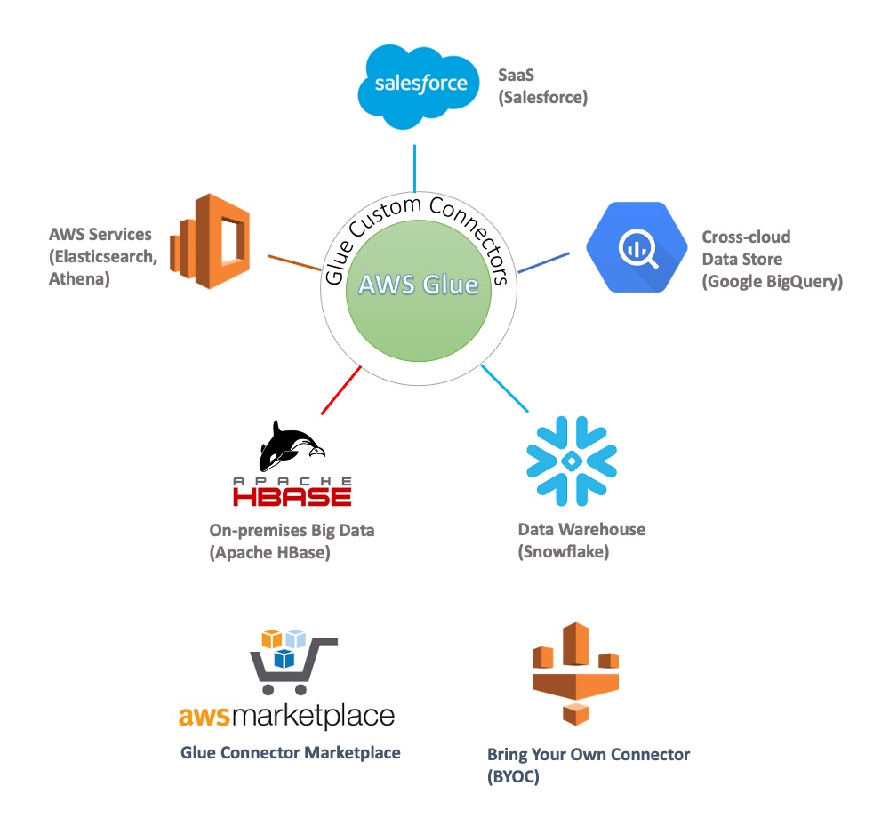

# AWS Glue Custom Connectors

AWS Glue Spark runtime natively supports connectivity to popular data sources such as Amazon Redshift, Amazon Aurora and RDS, Amazon DocumentDB (with MongoDB compatibility) and MongoDB, Amazon DynamoDB, and Amazon S3 (with different file formats). 

This development guide shows you how to implement, test, and validate (locally and on AWS Glue job system) a Glue connector for your data store that fits best for your applications. You can use one of the three interfaces to plug-in your connector into the Glue Spark runtime and deploy on AWS Glue for your workloads using the [Bring Your Own Connector](https://docs.aws.amazon.com/glue/latest/ug/connectors-chapter.html#creating-custom-connectors) workflow in AWS Glue Studio. These interfaces include Apache Spark DataSource, Amazon Athena Federated Query, and JDBC interfaces.

Users can also publish these connectors on [AWS Marketplace](https://aws.amazon.com/marketplace/search/results?searchTerms=glue%20connector&spellCheck=false) by following the [Creating Connectors for AWS Marketplace guide](marketplace/publishGuide.pdf). 

Glue Spark runtime features such as job bookmarks for incremental loads, at-source data filtering with SQL queries, partitioning for data parallelism, data type mapping, advanced Spark and built-in AWS Glue data transformations, VPC networking, integration with AWS Secrets Manager to securely store authentication  credentials, and AWS Glue Data Catalog for storing connections and table metadata) are supported with these interfaces, and AWS Glue Studio console for visual authoring of ETL jobs.

### Development Guide 

 - [Install Glue Spark Runtime](development/GlueSparkRuntime/README.md)

   This document walks you through on how to set up Glue Spark runtime locally on your laptop for development and testing.

 - [Spark Connector Development Guide](development/Spark/README.md)

   This document describes you the interfaces and how to implement a [simple](development/Spark/MinimalSparkConnector.java), [intermediate](development/Spark/SparkConnectorCSV.java) and [advanced](development/Spark/SparkConnectorMySQL.scala) Glue custom connector with Spark DataSource interfaces. The simple example illustrates how to implement the Spark Datasource interface. The intermediate example shows how to use Amazon S3 client to read data in CSV format from a S3 bucket with path supplied as connection options, and write data to a S3 bucket with some key prefix supplied as connection options. The advanced example shows how to implement a connector that uses a JDBC driver to read from and write to MySQL source. It also shows how to push down a user-supplied SQL query to filter records at source and authenticate with username and password supplied as connection options.
   
 - [Athena Connector Development Guide](development/Athena/README.md)

   This document describes how to implement an Glue connector based on the Amazon Athena DataSource interface. Glue connectors use the Athena interface, but they do not need to use a separate AWS Lambda function to read the data from the underlying data store. Instead, the implementation directly runs inline within each Spark executor to return the records as Apache Arrow format. It also uses an [intermediate](development/Athena/src) example to show how to implement a Glue connector with Athena interface to read a CSV file from Amazon S3.

### Local Validation Tests
 - [Validation Test Guide](localValidation/README.md)

   This document shows you the process of local validation with Glue Spark runtime on your laptop.
   
 - [Validation Test Examples](localValidation/)

   These example Spark scripts show you how to test your custom connector with Glue Spark runtime and its different features.

### Glue Job Validation
 - [Validation Guide](glueJobValidation/README.md)

   This document helps you to prepare your connector for validation on the Glue job system.

 - [Python Job Validation Script](glueJobValidation/glue_job_validation_update.py)

   This Python script shows you how to test your connector in AWS Glue job system with all validation tests.
   
### More Job Script Examples
 - [More Job Script Examples](gluescripts/README.md)

   Some more Glue job Scripts examples for each connector type with and without using catalog connections to read from data sources.

### Publish your connector to AWS Marketplace

If you would also like to publish your custom Glue connector to [AWS Marketplace](https://aws.amazon.com/marketplace/search/results?searchTerms=glue%20connector&spellCheck=false), pleaes first validate your connector works with Glue Spark runtime locally and on the Glue job system. Next, follow the guide to [Publish your connector to AWS Marketplace](marketplace/publishGuide.pdf). Finally, reach out to us at glue-connectors@amazon.com with details on your connector, validation test results, and other details to be published on AWS Marketplace.