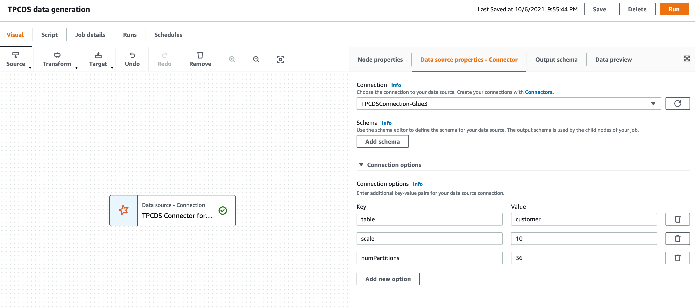

# TPC-DS Glue custom connector for Glue 3.0

You can access to the TPC-DS connector from [the product page on AWS Marketplace](https://aws.amazon.com/marketplace/pp/prodview-xtty6azr4xgey).


## What is the TPC-DS connector for AWS Glue?

The TPC-DS Glue connector generates TPC-DS compliant datasets based on specified scale factor and table name. The datasets will be generated inside the connector, and then Spark tasks can read each record of the TPC-DS datasets. Based on this connector mechanism, you don’t need to set up any data sources to generate the TPC-DS datasets, but you just specify the TPC-DS connector on your Glue ETL job.

After writing the generated datasets on your data target such as Amazon S3 with the Glue ETL job, the dataset can be used for any benchmarking purpose in AWS Glue jobs, Amazon Athena, Amazon EMR, Amazon Redshift Spectrum and so on.
Please refer to http://www.tpc.org/tpcds/ about TPC-DS and http://tpc.org/tpc_documents_current_versions/pdf/tpc-ds_v3.2.0.pdf about TPC-DS specification.


## Activate the TPC-DS connector from AWS Marketplace

You can subscribe to the TPC-DS connector from [its product page](https://aws.amazon.com/marketplace/pp/prodview-xtty6azr4xgey) on AWS Marketplace. Then, you can activate the connector from AWS Glue Studio.

The more detailed steps to set up the connector are described in the “Set up the TPC-DS connector and run a Glue ETL job with the connector” section below.


## Use the TPC-DS connector

To use the TPC-DS connector in your Glue ETL job, you need to activate the connector firstly and set connector options in the job. This part shows what options you can set to the connector and how to use it in your Glue ETL job.

### Connector options

You can pass the following options to the connector.

| option | description|
|---|---|
| `table` | **(required)** A table name. You can pick up a table from 25 tables. The table list is in https://github.com/awslabs/aws-athena-query-federation/tree/master/athena-tpcds. |
| `scale` | **(optional, default is `1`)** Generated data size. Possible range is `1` to `100000`. You can specify the size of generated data. Specifically scale 1 means that all table data will be generated with 1GB. For example, when you specify 7 for scale, 7GB data of all tables will be generated. More specific example of the relationship between the scale factor and the data size is described in the "Appendix" section below. This scale factor is described in "3 Scaling and Database Population" section in [TPC-DS Specification document](http://tpc.org/tpc_documents_current_versions/pdf/tpc-ds_v3.2.0.pdf). |
| `numPartitions` | **(optional, default is `1`)** The maximum number of concurrency to generate table data in parallel. |

#### Set the optimal `numPartitions` value

It's recommended that the value of `numPartitions` parameter be set based on **"Number of Workers"** of your ETL job. Here’s the calculation formula. The following calculation takes consideration in Glue 2.0 and 3.0. Please be aware that the calculation depends on the **"Worker type"** of your job as follows.


| Worker type | Glue 3.0 | Glue 2.0 |
|---|---|---|
|Standard	|`numPartitions = (Number of Workers * 2 - 1) * 4`	|`numPartitions = (Number of Workers * 2 - 1) * 4` |
|G.1X	|`numPartitions = (Number of Workers - 1) * 4`	|`numPartitions = (Number of Workers * 2 - 1) * 8` |
|G.2X	|`numPartitions = (Number of Workers - 1) * 8`	|`numPartitions = (Number of Workers * 2 - 1) * 16` |

For example, when your Glue 3.0 job is set to G.1X as the worker type and 10 number of workers, the `numPartitions` will be calculated by `(10 - 1) * 4 = 36`. If it’s Glue 2.0 job with the same worker type and number of workers, the `numPartitions` will be calculated by `(10 - 1) * 8 = 72`.


### Set up the TPC-DS connector and run a Glue ETL job with the connector

You can set up the TPC-DS connector and use it in your Glue ETL jobs by the following steps.

1. Setup TPC-DS connector and a related connection on Glue Studio console.
2. Create a job. You set necessary connector options.
3. Save and run the job.


#### Step 1: Set up the TPC-DS connector and create a relevant connection

To set up the TPC-DS connector and create a connection for your job:

1. Subscribe the TPC-DS connector from [the product page](https://aws.amazon.com/marketplace/pp/prodview-xtty6azr4xgey) on AWS marketplace.
2. After subscription of the connector, you can set up the connector from the activation link of AWS Glue Studio. Please select the Glue version of your ETL jobs.
    1. [Activate the TPC-DS connector for **Glue 3.0**](https://console.aws.amazon.com/gluestudio/home#/connector/add-connection?connectorName=%22TPCDS%20Connector%20for%20Glue%203.0%22&connectorType=%22Spark%22&connectorDescription=%22Generate%20the%20dataset%20for%20TPC-DS%20benchmark%20from%20AWS%20Glue%22&connectorUrl=%22https%3A%2F%2F709825985650.dkr.ecr.us-east-1.amazonaws.com%2Famazon-web-services%2Fglue-tpcds%3A1.0.0-glue3.0%22&connectorVersion=%221.0.0-glue3.0%22&connectorClassName=%22tpcds%22).
    2. If your job is Glue 1.0 or 2.0, [activate the TPC-DS connector for **Glue 1.0 or 2.0**](https://console.aws.amazon.com/gluestudio/home#/connector/add-connection?connectorName=%22TPCDS%20Connector%20for%20Glue%201.0%20and%202.0%22&connectorType=%22Spark%22&connectorDescription=%22Generate%20the%20dataset%20for%20TPC-DS%20benchmark%20from%20AWS%20Glue%22&connectorUrl=%22https%3A%2F%2F709825985650.dkr.ecr.us-east-1.amazonaws.com%2Famazon-web-services%2Fglue-tpcds%3A1.0.0-glue2.0%22&connectorVersion=%221.0.0-glue2.0%22&connectorClassName=%22tpcds%22).
3. Enter your connection name. You can optionally add a description and **"Network options"**. For **"Connection access"**, keep it empty.
4. Create the connection from **"Create connection and active connector"**.


#### Step 2: Create a job

To create a job from your connection which is created in the previous step:

1. Choose the connection and **"create job"**. Then, you can see the visual canvas.
2. Select your created connection figure on the visual canvas.
3. Add connection options and enter the necessary information. In particular, `table` option is required, and if needed, you can specify `scale` and `numPartitions` options. The following screenshot is the example of how you can put values on these options. You can see the detail about connector options at the "***Connector options***" section above.
4. After filling in connection options, also enter job properties in the **"Job details"** tab.
5. Choose **"Save"**


Example of specifying options of the TPC-DS connector in Glue Studio:



You can also specify those connector options to the job script directly. The following PySpark code shows the part of passing the above parameters such as `table`, `scale` and `numPartitions` to the part of creating a DynamicFrame.

```py
# Create a DynamicFrame based on the "customer" table
dyf = glue_context.create_dynamic_frame.from_options(
    connection_type="marketplace.spark",
    connection_options={
        "table": "customer",  # Specify a table name
        "scale": "10",  # Specify the number from 1 to 100000
        "numPartitions": "36", 
        "connectionName": "<Put the name of connection you created here>"
    },
    transformation_ctx="dyf",
)
```

The “Glue ETL job examples of using the connector” section below show whole scripts which write the generated table data to S3 and register the table on Glue Data Catalog.

#### Step 3: Save and run the job

After filling in all parameters and creating the connector job, you can run the job.


## Glue ETL job examples of using the connector

Using the following examples, you can generate the table data in the part of creating a DynamicFrame, and populate the table to S3 and Glue Data Catalog. After writing the data, the datasets can be used for any use by not only AWS Glue, also by Athena, Redshift spectrum and so on.

### Example 1 - Generating the "customer" table in the TPC-DS datasets, writing the table data to S3 and registering the table on Glue Data Catalog.

This example generates the "customer" table data by the TPC-DS connector and then writes the data to S3, and register the table on Glue Data Catalog. When you use this, please set your `connectionName` and `<YOUR_BUCKET_NAME>` in the script.

```py
from pyspark.context import SparkContext
from awsglue.context import GlueContext


glue_context = GlueContext(SparkContext())
spark = glue_context.spark_session

# Create the "customer" table DynamicFrame using the TPC-DS connector
dyf = glue_context.create_dynamic_frame.from_options(
    connection_type="marketplace.spark",
    connection_options={
        "table": "customer",
        "scale": "10",
        "numPartitions": "36",
        "connectionName": "<Put the name of connection you created here>"},
    transformation_ctx="dyf")
  
# Show the output of "customer" table
dyf.toDF().show(5, False)
"""
+-------------+----------------+------------------+------------------+-----------------+----------------------+---------------------+------------+------------+-----------+---------------------+-----------+-------------+------------+---------------+-------+----------------------------+---------------------+
|c_customer_sk|c_customer_id   |c_current_cdemo_sk|c_current_hdemo_sk|c_current_addr_sk|c_first_shipto_date_sk|c_first_sales_date_sk|c_salutation|c_first_name|c_last_name|c_preferred_cust_flag|c_birth_day|c_birth_month|c_birth_year|c_birth_country|c_login|c_email_address             |c_last_review_date_sk|
+-------------+----------------+------------------+------------------+-----------------+----------------------+---------------------+------------+------------+-----------+---------------------+-----------+-------------+------------+---------------+-------+----------------------------+---------------------+
|1            |AAAAAAAABAAAAAAA|980124            |7135              |32946            |2452238               |2452208              |Mr.         |Javier      |Lewis      |Y                    |9          |12           |1936        |CHILE          |null   |Javier.Lewis@VFAxlnZEvOx.org|2452508              |
|2            |AAAAAAAACAAAAAAA|819667            |1461              |31655            |2452318               |2452288              |Dr.         |Amy         |Moses      |Y                    |9          |4            |1966        |TOGO           |null   |Amy.Moses@Ovk9KjHH.com      |2452318              |
|3            |AAAAAAAADAAAAAAA|1473522           |6247              |48572            |2449130               |2449100              |Miss        |Latisha     |Hamilton   |N                    |18         |9            |1979        |NIUE           |null   |Latisha.Hamilton@V.com      |2452313              |
|4            |AAAAAAAAEAAAAAAA|1703214           |3986              |39558            |2450030               |2450000              |Dr.         |Michael     |White      |N                    |7          |6            |1983        |MEXICO         |null   |Michael.White@i.org         |2452361              |
|5            |AAAAAAAAFAAAAAAA|953372            |4470              |36368            |2449438               |2449408              |Sir         |Robert      |Moran      |N                    |8          |5            |1956        |FIJI           |null   |Robert.Moran@Hh.edu         |2452469              |
+-------------+----------------+------------------+------------------+-----------------+----------------------+---------------------+------------+------------+-----------+---------------------+-----------+-------------+------------+---------------+-------+----------------------------+---------------------+
only showing top 5 rows
"""

# Create the "customer" table data on Glue Data Catalog,
# and write the table data to S3.
sink = glue_context.getSink(
    connection_type="s3", 
    path=f"s3://<YOUR_BUCKET_NAME>/",
    enableUpdateCatalog=True,
    updateBehavior="UPDATE_IN_DATABASE")
sink.setFormat("glueparquet")
sink.setCatalogInfo(catalogDatabase="tpcds", catalogTableName="customer")
sink.writeFrame(dyf)

```


### Example 2 - Registering all tables to the Glue Data Catalog and writing them to S3

This example generates all the table data in the TPC-DS datasets by the connector and then writes the data to S3, and register all the tables on Glue Data Catalog. When you use this script, please set your `connectionName` and `<YOUR_BUCKET_NAME>` in the script.

```py
from pyspark.context import SparkContext
from awsglue.context import GlueContext


glue_context = GlueContext(SparkContext())
spark = glue_context.spark_session

# The list of tables defined in the TPC-DS
tables = [
    "call_center", "catalog_returns", "catalog_page", "catalog_sales",
    "customer", "customer_address", "customer_demographics",
    "date_dim", "dbgen_version", "household_demographics",
    "income_band", "inventory", "item", "promotion", "reason",
    "ship_mode", "store", "store_returns", "store_sales",
    "time_dim", "warehouse",
    "web_page", "web_returns", "web_sales", "web_site"]

"""
For each table, create a DynamicFrame, 
write it to S3 and register the table on Glue Data Catalog.
"""
for table in tables:
    # Create a DynamicFrame for `table`
    dyf = glue_context.create_dynamic_frame.from_options(
        connection_type="marketplace.spark",
        connection_options={
            "table": table,
            "scale": "10",
            "numPartitions": "36",
            "connectionName": "<Put the name of connection you created here>"},
        transformation_ctx="dyf")
    
    # Write the DynamicFrame to S3 and register the table.
    sink = glue_context.getSink(
        connection_type="s3", 
        path=f"s3://<YOUR_BUCKET_NAME>/table={table}/",
        enableUpdateCatalog=True,
        updateBehavior="UPDATE_IN_DATABASE")   
    sink.setFormat("glueparquet")
    sink.setCatalogInfo(catalogDatabase="tpcds", catalogTableName=table)
    sink.writeFrame(dyf)
```


## Appendix - generated data size depending on a scale factor

The following table shows the relationship between a scale factor and generated data size for each table in csv format without an compression on Amazon S3. Each generated table size is approximately computed by `aws s3 ls` command.


| table |scale = 1 (min) | scale = 10 | scale = 100 | scale = 1000 | scale = 10000 | scale = 100000 (max) |
|---|---|---|---|---|---|---|
| customer_center | 4.5 (KB) | 16.2 (KB) | 18.0 (KB) | 22.1 (KB) | 26.4 (KB) | 28.4 (KB) |
| catalog_page | 1.6 (MB) | 1.8 (MB) | 3.1 (MB) | 4.4 (MB) | 5.8 (MB) | 7.2 (MB) |
| catalog_returns | 17.1 (MB) | 178.7 (MB) | 1.8 (GB) | 18.6 (GB) | 192.2 (GB) | 1.9 (TB) |
| catalog_sales | 224.6 (MB) | 2.3 (GB) | 23.2 (GB) | 239.9 (GB) | 2.4 (TB) | 24.3 (TB) |
| customer | 13.0 (MB) | 66.2 (MB) | 265.2 (MB) | 1.5 (GB) | 8.6 (GB) | 13.2 (GB) |
| customer_address | 5.7 (MB) | 29.3 (MB) | 116.6 (MB) | 703.8 (MB) | 3.8 (GB) | 5.7 (GB) |
| customer_demographics | 80.4 (MB) | 80.6 (MB) | 80.6 (MB) | 80.6 (MB) | 80.7 (MB) | 80.7 (MB) |
| date_dim | 10.0 (MB) | 10.5 (MB) | 10.5 (MB) | 10.5 (MB) | 10.5 (MB) | 10.5 (MB) |
| dbgen_version | 140.3 (Bytes) | 154.6 (Bytes) | 155.6 (Bytes) | 156.7 (Bytes) |156.7 (Bytes) |158.7 (Bytes) |
| household_demographics | 152.1 (KB) | 273.6 (KB) | 273.6 (KB) | 273.6 (KB) | 281.3 (KB) | 281.3 (KB) |
| income_band | 1.2 (KB) | 1.2 (KB) | 1.2 (KB) | 1.2 (KB) | 1.2 (KB) | 1.2 (KB) |
| inventory | 219.4 (MB) | 2.5 (GB) | 7.9 (GB) | 15.7 (GB) | 26.4 (GB) | 39.7 (GB) |
| item | 4.9 (MB) | 28.5 (MB) | 57.1 (MB) | 84.1 (MB) | 112.6 (MB) | 140.5 (MB) |
| promotion | 63.8 (KB) | 66.7 (KB) | 128.6 (KB) | 191.3 (KB) | 736.3 (KB) | 798.7 (KB) |
| reason | 2.2 (KB) | 2.5 (KB) | 2.8 (KB) | 3.1 (KB) | 3.3 (KB) | 3.4 (KB) |
| ship_mode | 2.6 (KB) | 2.6 (KB) | 2.6 (KB) | 2.6 (KB) | 2.6 (KB) | 2.6 (KB) |
| store | 7.9 (KB) | 35.9 (KB) | 118.9 (KB) | 285.5 (KB) | 424.2 (KB) | 1.2 (MB) |
| store_returns | 24.4 (MB) | 255.1 (MB) | 2.6 (GB) | 26.6 (GB) | 274.2 (GB) |2.8 (TB) |
| store_sales | 280.0 (MB) | 2.9 (GB) | 29.4 (GB) | 302.3 (GB) | 3.1 (TB) |30.7 (TB) |
| time_dim | 4.9 (MB) | 5.0 (MB) | 5.0 (MB) |5.0 (MB) |5.0 (MB) |5.0 (MB) |
| warehouse | 1.5 (KB) | 3.1 (KB) | 4.6 (KB) | 6.1 (KB) | 6.8 (KB) | 7.4 (KB) |
| web_page | 9.8 (KB) | 23.2 (KB) | 548.9 (KB) | 642.8 (KB) | 762.0 (KB) | 860.0 (KB) |
| web_returns | 7.8 (MB) | 81.6 (MB) | 841.6 (MB) | 8.5 (GB) | 88.1 (GB) | 890.3 (GB) |
| web_sales | 111.2 (MB) | 1.1 (GB) | 11.6 (GB) | 119.5 (GB) | 1.2 (TB) | 12.1 (TB)|
| web_site | 16.4 (KB) | 20.0 (KB) | 14.5 (KB) | 23.4 (KB) | 30.8 (KB) | 36.0 (KB)|
| **total size of all tables** | 1029.5 (MB) | 9.9 (GB) | 81.6 (GB) | 769.1 (GB) | 7.8 (TB) | 78.1 (TB) |
